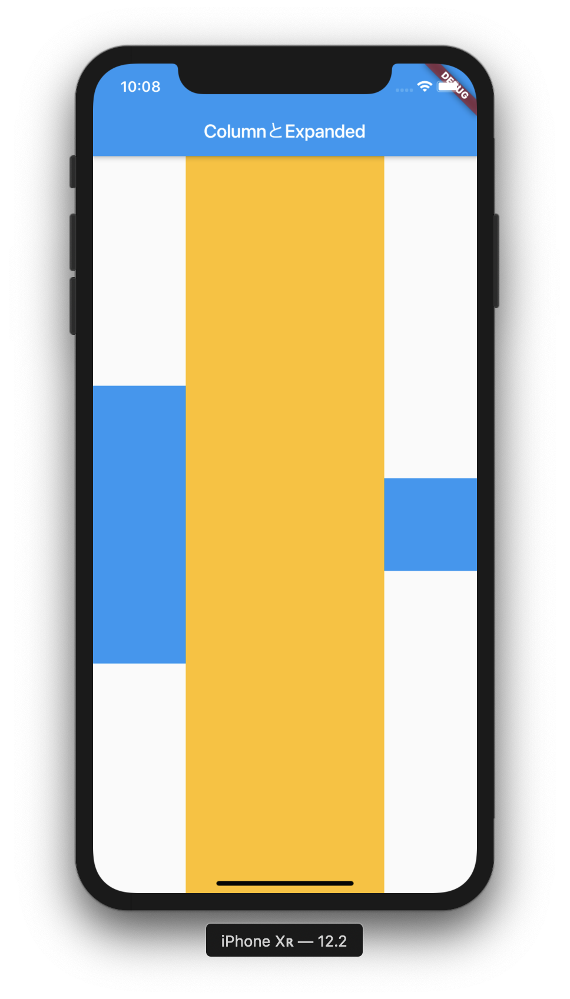
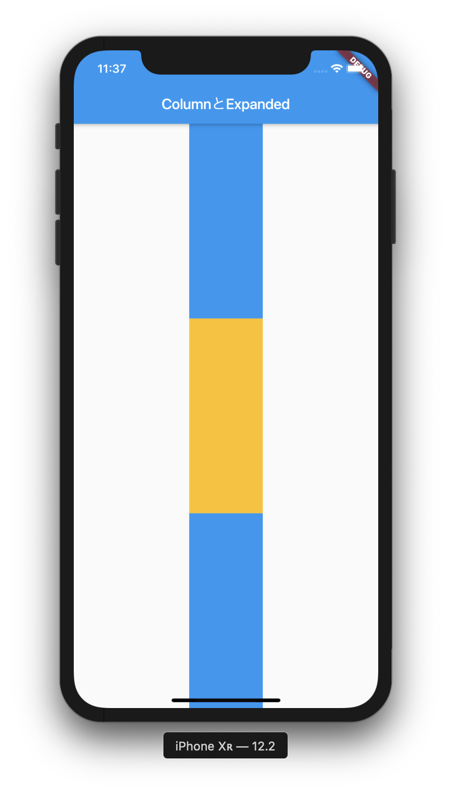
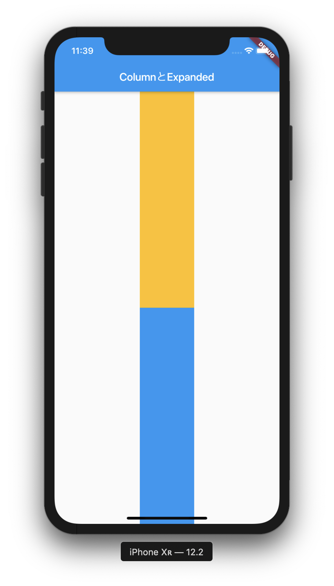
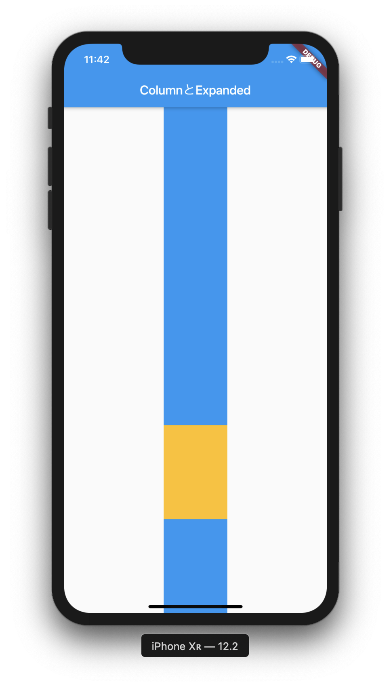
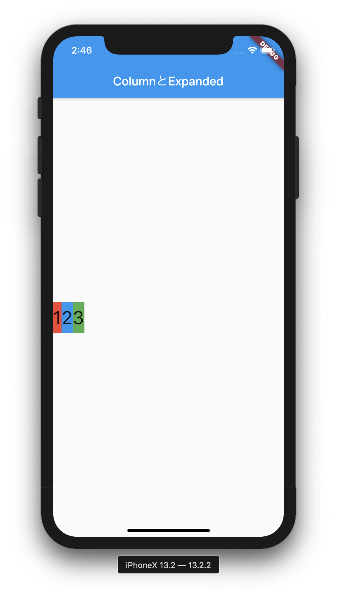
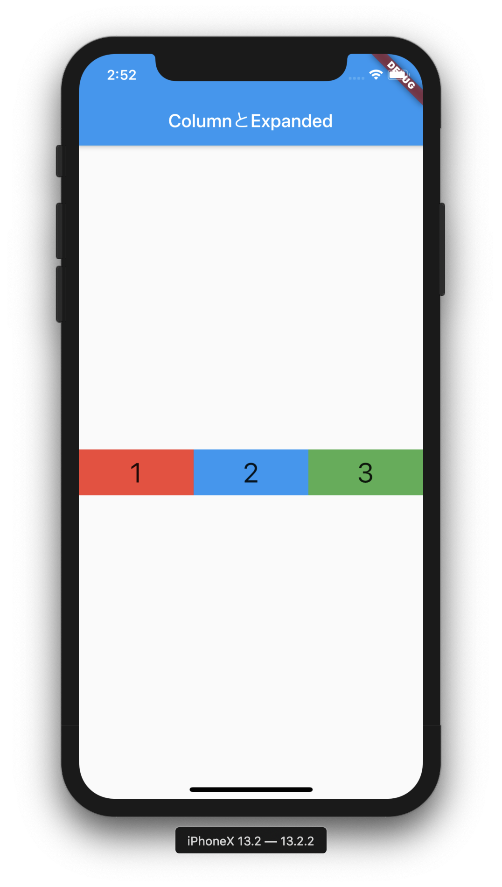
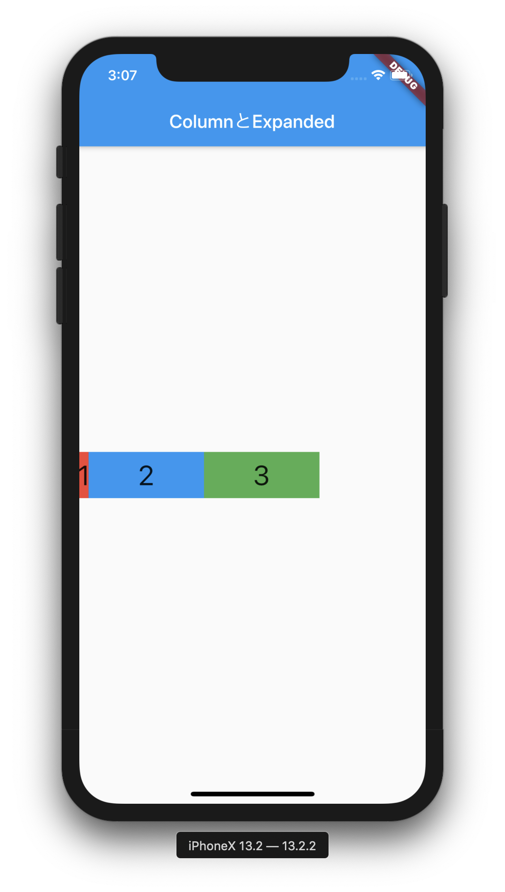

Flutter は動画コンテンツも充実していて週毎にウィジェットを紹介している Flutter Widget of the Week では短い動画でウィジェットの概要を掴むことができる動画を視聴できます。

Flutter Widget of the Week を見るだけでも勉強になるのですが、記憶力が良くないので、視聴によるインプットだけでなく手元でコードを動かしてそれをブログ記事にする所までやって後から思い出しやすいようにしてみるシリーズです。

これまでの記事は以下のリンクから参照できます。

今回取り上げるのは Expanded と Flexible です。

## Expanded とは

Flutter Widget of the Week で Expanded をとりあげた動画は以下です。Expanded のドキュメントを見ると、子のウィジェットが使用可能なスペースを埋めるように、Row、Column、Flex の子ウィジェットを展開するウィジェットと説明があります。

[Expanded (Flutter Widget of the Week) - YouTube](https://www.youtube.com/watch?v=_rnZaagadyo)

## Expanded を使ってみる

### Column と Expanded

要素の配列を vertical に表示する Column と Expanded を使ってみます。Expanded を使用すると Expanded でないウィジェット同士の隙間を埋めるように Expanded ウィジェットが展開されて表示されます。

```dart
import 'package:flutter/material.dart';

void main() => runApp(MyApp());

class MyApp extends StatelessWidget {
  static const String _title = "Sample";

  @override
  Widget build(BuildContext context) {
    return MaterialApp(
      title: _title,
      home: MyStatelessWidget(),
    );
  }
}

class MyStatelessWidget extends StatelessWidget {
  MyStatelessWidget({Key key}) : super(key: key);

  @override
  Widget build(BuildContext context) {
    return Scaffold(
        appBar: AppBar(
          title: Text('ColumnとExpanded'),
        ),
        body: columnExpandedBody());
  }

  Widget columnExpandedBody() {
    return Center(
      child: Column(
        children: <Widget>[
          Container(
            color: Colors.blue,
            height: 100,
            width: 100,
          ),
          Expanded(
            child: Container(
              color: Colors.amber,
              width: 100,
            ),
          ),
          Container(
            color: Colors.blue,
            height: 100,
            width: 100,
          )
        ],
      ),
    );
  }
}

```

### Row と Expanded

次に Column の代わりに Row を使ってみます。

```dart
import 'package:flutter/material.dart';

void main() => runApp(MyApp());

class MyApp extends StatelessWidget {
  static const String _title = "Sample";

  @override
  Widget build(BuildContext context) {
    return MaterialApp(
      title: _title,
      home: MyStatelessWidget(),
    );
  }
}

class MyStatelessWidget extends StatelessWidget {
  MyStatelessWidget({Key key}) : super(key: key);

  @override
  Widget build(BuildContext context) {
    return Scaffold(
        appBar: AppBar(
          title: Text('ColumnとExpanded'),
        ),
        body: rowExpandedBody());
  }

  // ... columnExpandedBody()は省略

  Widget rowExpandedBody() {
    return Center(
      child: Row(
        children: <Widget>[
          Container(
            color: Colors.blue,
            height: 300,
            width: 100,
          ),
          Expanded(
            child: Container(
              color: Colors.amber,
              width: 100,
            ),
          ),
          Container(
            color: Colors.blue,
            height: 100,
            width: 100,
          )
        ],
      ),
    );
  }
}
```

実行結果は以下です。要素の配列を horizontal に表示する Row と Expanded を使ってみると、同じように Expanded でないウィジェット同士の隙間を埋めるように Expanded ウィジェットが展開されて表示されます。



### Column の中に複数の Expanded ウィジェット

```dart
import 'package:flutter/material.dart';

void main() => runApp(MyApp());

class MyApp extends StatelessWidget {
  static const String _title = "Sample";

  @override
  Widget build(BuildContext context) {
    return MaterialApp(
      title: _title,
      home: MyStatelessWidget(),
    );
  }
}

class MyStatelessWidget extends StatelessWidget {
  MyStatelessWidget({Key key}) : super(key: key);

  @override
  Widget build(BuildContext context) {
    return Scaffold(
        appBar: AppBar(
          title: Text('ColumnとExpanded'),
        ),
        body: columnExpandedContainers());
  }

  // ... columnExpandedBody()の実装は省略
  // ... rowExpandedBody()の実装は省略

  Widget columnExpandedContainers() {
    return Center(
      child: Column(
        children: <Widget>[
          Expanded(
            flex: 1,
            child: Container(
              color: Colors.blue,
              width: 100,
            ),
          ),
          Expanded(
            flex: 1,
            child: Container(
              color: Colors.amber,
              width: 100,
            ),
          ),
          Expanded(
            flex: 1,
            child: Container(
              color: Colors.blue,
              width: 100,
            ),
          )
        ],
      ),
    );
  }
}

```

### Column の中で高さが固定のウィジェットと複数の Expanded ウィジェット

```dart
import 'package:flutter/material.dart';

void main() => runApp(MyApp());

class MyApp extends StatelessWidget {
  static const String _title = "Sample";

  @override
  Widget build(BuildContext context) {
    return MaterialApp(
      title: _title,
      home: MyStatelessWidget(),
    );
  }
}

class MyStatelessWidget extends StatelessWidget {
  MyStatelessWidget({Key key}) : super(key: key);

  @override
  Widget build(BuildContext context) {
    return Scaffold(
        appBar: AppBar(
          title: Text('ColumnとExpanded'),
        ),
        body: columnExpandedsAndFixedHeightContainers());
  }

  // ... columnExpandedBody()の実装は省略
  // ... rowExpandedBody()の実装は省略
  // ... columnExpandedContainers()の実装は省略

  Widget columnExpandedsAndFixedHeightContainers() {
    return Center(
      child: Column(
        children: <Widget>[
          Expanded(
            flex: 1,
            child: Container(
              color: Colors.blue,
              width: 100,
            ),
          ),
          Container(
            color: Colors.amber,
            width: 100,
            height: 200,
          ),
          Expanded(
            flex: 5,
            child: Container(
              color: Colors.black26,
              width: 100,
            ),
          )
        ],
      ),
    );
  }
}

```

## Expanded のその他主要なプロパティ

ここまでで登場したプロパティはコンストラクタで値を渡した flex、child ですが他にも色々あります。

### fit

fit プロパティの型は FlexFit という enum で。子ウィジェットが利用可能なスペースに対してどのように内接するかを表しています。もし flex に 0 が割り当てられていた場合は、fit に割り当てられた値が親ウィジェットが使用可能なスペースを子が埋めるかどうかを決定します。

もし fit に割り当てられた値が`FlexFit.tight`なら、子のウィジェットは利用可能なスペースを埋めます。そして`FlexFit.loose`の場合、子のウィジェットを最大限可能な大きさにできます。これはそれより小さく出来ることも意味しています。

利用可能なプロパティとしてドキュメントにあったのでプロパティに代入してみましたが代入できません。また、コンストラクタでも値を割り当てることができません。

ソースコードを読んでみると Expanded は Flexible を継承していてイニシャライズ時に FlexFit.tight を割り当てていることが確認できます。

```dart
class Expanded extends Flexible {
  /// Creates a widget that expands a child of a [Row], [Column], or [Flex]
  /// so that the child fills the available space along the flex widget's
  /// main axis.
  const Expanded({
    Key key,
    int flex = 1,
    @required Widget child,
  }) : super(key: key, flex: flex, fit: FlexFit.tight, child: child);
}
```

そして Flexible のコードを読むと fit プロパティは final で宣言されていることが確認できます。

```dart
  final FlexFit fit;
```

FlexFit.tight、この挙動が Expanded を特徴付けているもののようです。

### Expanded の挙動を見てみる

このコードの flex を変更したり height を変更したりしながら Expanded を使ったウィジェットがどのような表示になるか見てみます。

```dart
Widget columnExpandedContainers() {
    return Center(
      child: Column(
        children: <Widget>[
          Expanded(
            flex: 1,
            child: Container(
              color: Colors.blue,
              width: 100,
            ),
          ),
          Expanded(
            flex: 1,
            child: Container(
              color: Colors.amber,
              width: 100,
            ),
          ),
          Expanded(
            flex: 1,
            child: Container(
              color: Colors.blue,
              width: 100,
            ),
          )
        ],
      ),
    );
  }
```

初期表示は以下です。



配列の先頭のウィジェットのコンストラクタ引数 flex に 0 を割り当ててみます。



0 を割り当てたウィジェットが表示されなくなりました。

次は以下のように flex に 0 を渡した上で引数 height にも値を渡してみます。

```dart
Expanded(
  flex: 0,
  child: Container(
  color: Colors.blue,
  width: 100,
  height: 500,
  ),
);
```



実行すると先程は非表示になっていた先頭のウィジェットが表示されています。この挙動は Expanded のスーパークラスである Flexible で宣言している fit プロパティのドキュメンテーションコメントの挙動と一致します。

```dart
/// If [flex] is non-zero, the [fit] determines whether the child fills the
/// space the parent makes available during layout.
```

## Flexible とは

Expanded と Flexible、この 2 つをそれぞれ調べていると、2 つのクラスの使い分けについて書いた記事や質問がいくつか目に入ります。Expanded と関係の深いクラスということで動画では別々に紹介されているのですが、合わせて書いたほうが両方のクラスについてより理解できる気がしたので今回は合わせてとりあげます。

動画は以下になります。

<iframe width="560" height="315" src="https://www.youtube.com/embed/CI7x0mAZiY0" frameborder="0" allow="accelerometer; autoplay; encrypted-media; gyroscope; picture-in-picture" allowfullscreen></iframe>

与えられたサイズに応じて柔軟に Widget の大きさを変えたい時に Flexible を使用します。Expanded のスーパークラスなので、flex や fit をプロパティに持っています。

## Flexible を使ってみる

Flexible でラップした複数の Container を要素に持つ Row を Center でラップして返す関数 rowFlexibles を定義して実行してみます。

まずは Flexible をつかわずに複数の Container を要素に持つ Row を Center でラップして返す関数 rowContainers を定義して実行してみます。

```dart
import 'package:flutter/material.dart';

void main() => runApp(MyApp());

class MyApp extends StatelessWidget {
  static const String _title = "Sample";

  @override
  Widget build(BuildContext context) {
    return MaterialApp(
      title: _title,
      home: MyStatelessWidget(),
    );
  }
}

class MyStatelessWidget extends StatelessWidget {
  MyStatelessWidget({Key key}) : super(key: key);

  @override
  Widget build(BuildContext context) {
    return Scaffold(
        appBar: AppBar(
          title: Text('ColumnとExpanded'),
        ),
        body: rowContainers());
  }

Widget rowContainers() {
  return Center(
    child: Row(
      children: <Widget>[
        Container(
          alignment: Alignment.center,
          height: 50,
          color: Colors.red,
          child: Text(
            '1',
            style: TextStyle(fontSize: 30),
            textAlign: TextAlign.center,
          ),
        ),
        Container(
          alignment: Alignment.center,
          height: 50,
          color: Colors.blue,
          child: Text(
            '2',
            style: TextStyle(fontSize: 30),
            textAlign: TextAlign.center,
          ),
        ),
        Container(
          alignment: Alignment.center,
          height: 50,
          color: Colors.green,
          child: Text(
            '3',
            style: TextStyle(fontSize: 30),
            textAlign: TextAlign.center,
          ),
        )
      ],
    ),
  );
}

```



次に要素の Container を Flexible でラップして表示してみます。

```dart
import 'package:flutter/material.dart';

void main() => runApp(MyApp());

class MyApp extends StatelessWidget {
  static const String _title = "Sample";

  @override
  Widget build(BuildContext context) {
    return MaterialApp(
      title: _title,
      home: MyStatelessWidget(),
    );
  }
}

class MyStatelessWidget extends StatelessWidget {
  MyStatelessWidget({Key key}) : super(key: key);

  @override
  Widget build(BuildContext context) {
    return Scaffold(
        appBar: AppBar(
          title: Text('ColumnとExpanded'),
        ),
        body: rowFlexibles());
  }

Widget rowFlexibles() {
  return Center(
    child: Row(
      children: <Widget>[
        Flexible(
          child: Container(
            alignment: Alignment.center,
            height: 50,
            color: Colors.red,
            child: Text(
              '1',
              style: TextStyle(fontSize: 30),
              textAlign: TextAlign.center,
            ),
          ),
        ),
        Flexible(
          child: Container(
            alignment: Alignment.center,
            height: 50,
            color: Colors.blue,
            child: Text(
              '2',
              style: TextStyle(fontSize: 30),
              textAlign: TextAlign.center,
            ),
          ),
        ),
        Flexible(
          child: Container(
            alignment: Alignment.center,
            height: 50,
            color: Colors.green,
            child: Text(
              '3',
              style: TextStyle(fontSize: 30),
              textAlign: TextAlign.center,
            ),
          ),
        )
      ],
    ),
  );
}

```

実行結果は以下です



Expanded と同じ動きをしているようにみえます。Flexible のインスタンスの fit プロパティは FlexFit.loose で Expanded と異なりますが Expanded の child に渡した Widget で明示的に指定した場合はそちらが優先されます。今回は明示的に指定していないのでそうなりませんでした。

FlexFit のソースを見ると Expanded には tight が、Flexible には loose が割り当てられることが記載されています。

```dart
enum FlexFit {
  /// The child is forced to fill the available space.
  ///
  /// The [Expanded] widget assigns this kind of [FlexFit] to its child.
  tight,

  /// The child can be at most as large as the available space (but is
  /// allowed to be smaller).
  ///
  /// The [Flexible] widget assigns this kind of [FlexFit] to its child.
  loose,
}
```

それでは明示的にサイズを指定してみます。

```dart
import 'package:flutter/material.dart';

void main() => runApp(MyApp());

class MyApp extends StatelessWidget {
  static const String _title = "Sample";

  @override
  Widget build(BuildContext context) {
    return MaterialApp(
      title: _title,
      home: MyStatelessWidget(),
    );
  }
}

class MyStatelessWidget extends StatelessWidget {
  MyStatelessWidget({Key key}) : super(key: key);

  @override
  Widget build(BuildContext context) {
    return Scaffold(
        appBar: AppBar(
          title: Text('ColumnとExpanded'),
        ),
        body: rowSizedFlexibles());
  }

Widget rowSizedFlexibles() {
  return Center(
    child: Row(
      children: <Widget>[
        Flexible(
          child: Container(
            alignment: Alignment.center,
            height: 50,
            width: 10,
            color: Colors.red,
            child: Text(
              '1',
              style: TextStyle(fontSize: 30),
              textAlign: TextAlign.center,
            ),
          ),
        ),
        Flexible(
          child: Container(
            alignment: Alignment.center,
            height: 50,
            color: Colors.blue,
            child: Text(
              '2',
              style: TextStyle(fontSize: 30),
              textAlign: TextAlign.center,
            ),
          ),
        ),
        Flexible(
          child: Container(
            alignment: Alignment.center,
            height: 50,
            color: Colors.green,
            child: Text(
              '3',
              style: TextStyle(fontSize: 30),
              textAlign: TextAlign.center,
            ),
          ),
        )
      ],
    ),
  );
}

```

先頭の Flexible のコンストラクタ引数 child に渡した Container に対してのみ width を明示的に指定しました。表示は以下のようになります。



先頭のウィジェットの width が指定した通りになっていることがわかります。

## Flexible と Expanded の使い分け

親のサイズに応じたサイズの調整を行える Flexible ですが用途の似ているように見えるこの２つはどう使い分けるべきなのか、Flexible のドキュメントを引用します。

> unlike Expanded, Flexible does not require the child to fill the available space.
> https://api.flutter.dev/flutter/widgets/Flexible-class.html

拙翻訳ですが子が使用可能なスペースを埋める必要がない場合に Flexible を使用するべきと読めます。FlexFit 型の fit プロパティの違いによる挙動を説明しているのだと思います。

### まとめ
