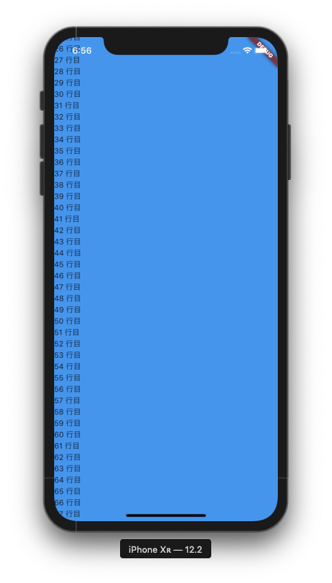
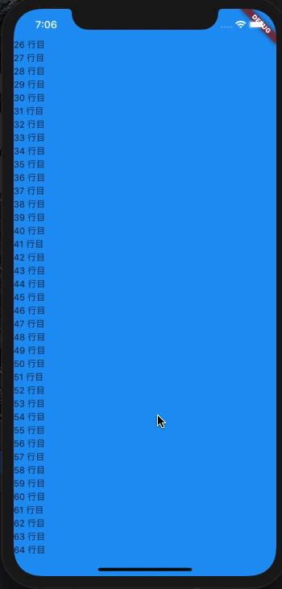
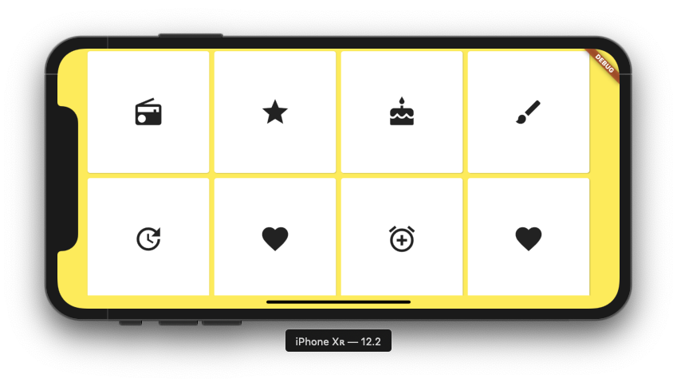
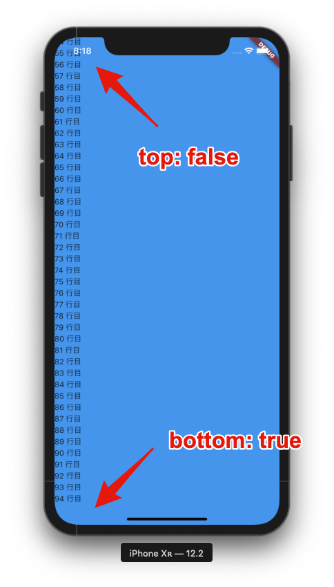
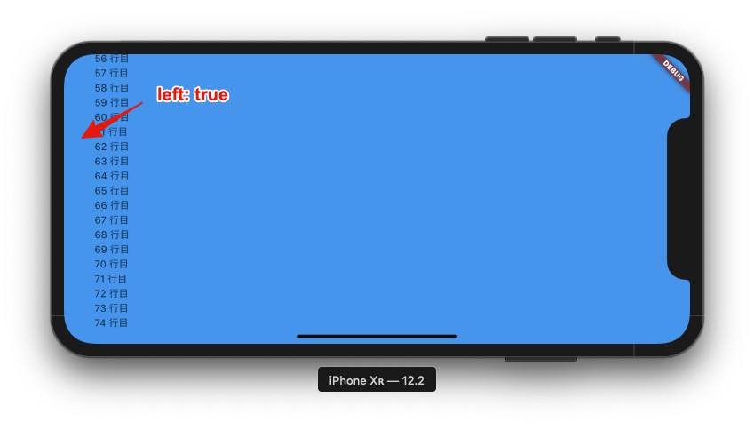
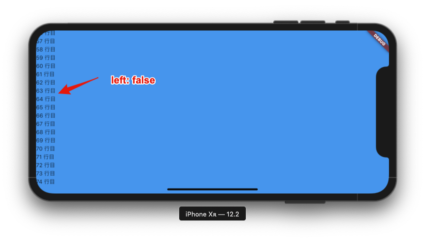
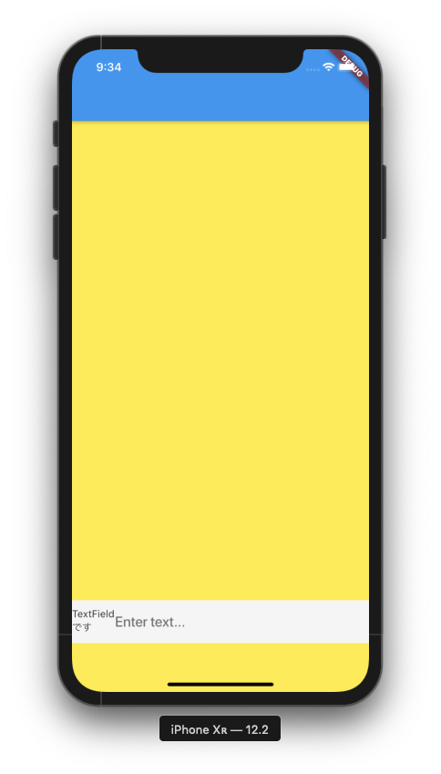
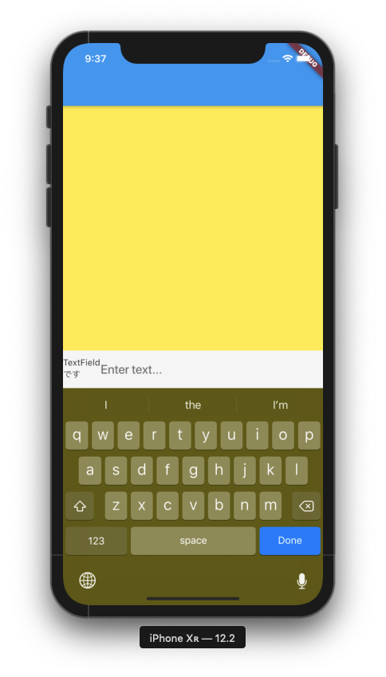
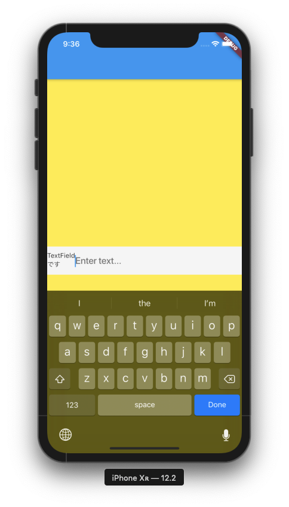

Flutter の学習を始めてまだ間もないですが、Flutter は公式に提供されているドキュメントが読みやすく学習がしやすい印象があります。動画コンテンツも充実していて週毎にウィジェットを紹介している Flutter Widget of the Week では短い動画でウィジェットの概要を掴むことができる動画を視聴できます。

iOS アプリエンジニアとして働いているのですが、iOS アプリの UI はたいてい UIKit というフレームワークを使って作ります。UIKit を使っていて感じていたのは各 UI オブジェクトとその使い方を知識として知っているか知らないかが UI の構築の時間の長短に大きく影響することでした。知っているとすぐに作ることができる UI でも知らないと遠回りな実装をしてしまったり実装に時間がかかってしまったりします。

Flutter の経験はほぼなくこれから学習をすすめて業務で使えるところまで持っていきたいなと考えているのですが、たくさん提供されている Widget を組み合わせて UI をつくっていくので、UIKit と同じように何のために、どのように使うのかを知っている Widget が多いほど UI を作るのに苦労しないんじゃないかと思って Flutter Widget of the Week をひとつずつ見ていくことにしました。

Flutter Widget of the Week を見るだけでも勉強になるのですが、記憶力が良くないので、視聴によるインプットだけでなく手元でコードを動かしてそれをブログ記事にする所までやって後から思い出しやすいようにしてみようとこの記事を書きました。

そのため、この記事は飽きない限りシリーズとして続いていくものになると思います。前置きが長くなりましたが本題に入ります。

## SafeArea とは

SafeArea を使用すると OS に関わらず適切な領域にウィジェットを収めてくれます。画面の上部にあるステータスバーでウィジェットが隠れないように、iPhone X のノッチなどでも表示がおかしくならないように子のウィジェットをインデントします。

MediaQuery を使って画面の範囲を調べて child ウィジェットを画面に対して適切に表示されるよう配置します。

## 使ってみる

ListView を使って Text をリスト表示してみます。

```dart
import 'package:flutter/material.dart';

void main() => runApp(MyApp());

class MyApp extends StatelessWidget {
  // This widget is the root of your application.
  @override
  Widget build(BuildContext context) {
    return MaterialApp(
      title: 'Flutter Demo',
      theme: ThemeData(
        primarySwatch: Colors.blue,
      ),
      home: SafeAreaSample(),
    );
  }
}

class SafeAreaSample extends StatelessWidget {
  @override
  Widget build(BuildContext context) {
    return Scaffold(
      body: ListView(
        children: List.generate(100, (i) => Text('$i 行目')),
      ),
      backgroundColor: Colors.blue,
    );
  }
}
```

このコードを iPhone XR の Simulator でビルドして実行します。いくらかスクロールすると iPhoneXR などノッチがあるタイプのデバイス特有の表示領域のせいでレイアウトが崩れてしまっているのがわかるかと思います。昔ながらの長方形の表示領域のデバイスだけではなくなってきているのと、特徴的な表示領域を持つデバイスはノッチがあるデバイスだけではありません。その部分をまるっと任せて適切に表示するためのウィジェットとして SafeArea が使用できます。



```dart
import 'package:flutter/material.dart';

void main() => runApp(MyApp());

class MyApp extends StatelessWidget {
  // This widget is the root of your application.
  @override
  Widget build(BuildContext context) {
    return MaterialApp(
      title: 'Flutter Demo',
      theme: ThemeData(
        primarySwatch: Colors.blue,
      ),
      home: SafeAreaSample(),
    );
  }
}

class SafeAreaSample extends StatelessWidget {
  @override
  Widget build(BuildContext context) {
    return Scaffold(
      body: SafeArea( // ListViewをSafeAreaでラップしただけ
        child: ListView(
          children: List.generate(100, (i) => Text('$i 行目')),
        ),
      ),
      backgroundColor: Colors.blue,
    );
  }
}

```

このコードを実機で動かすと iPhone XR の表示領域でも表示が崩れないようにインデントされているのがわかります。



Scaffold の body を SafeArea でラップするのが一番簡単です。動画でもその旨が説明されていました。

さて、以下のようなドキュメントの冒頭の説明や、動画で MediaQuery を使って表示領域を計算して適切な表示にすると説明があった点を踏まえると、

> A widget that insets its child by sufficient padding to avoid intrusions by the operating system.
> https://api.flutter.dev/flutter/widgets/SafeArea-class.html

Scaffold の body ではなくウィジェットツリーの内部で使うと表示が崩れそうな気がします。

試してみます。

```dart
import 'package:flutter/material.dart';

void main() => runApp(MyApp());

class MyApp extends StatelessWidget {
  // This widget is the root of your application.
  @override
  Widget build(BuildContext context) {
    return MaterialApp(
      title: 'Flutter Demo',
      theme: ThemeData(
        primarySwatch: Colors.blue,
      ),
      home: SafeAreaSample(),
    );
  }
}

class SafeAreaSample extends StatelessWidget {
  final icons = [
    Icons.radio,
    Icons.star,
    Icons.cake,
    Icons.brush,
    Icons.update,
    Icons.favorite,
    Icons.add_alarm,
    Icons.favorite,
  ];
  @override
  Widget build(BuildContext context) {
    return Scaffold(
      body: SafeArea(
        child: GridView.builder(
          itemCount: icons.length,
          gridDelegate: SliverGridDelegateWithFixedCrossAxisCount(
            crossAxisCount: 4,
          ),
          itemBuilder: (context, index) {
            return Card(
              child: Icon(icons[index], size: 50),
            );
          },
        ),
      ),
      backgroundColor: Colors.yellow,
    );
  }
}
```

このコードでビルドして実行すると以下のようにタイル状に表示されます。Scaffold の body プロパティを SafeArea でラップしているのでウィジェット全体の上下左右に対して SafeArea 対応がされます。



```dart
import 'package:flutter/material.dart';

void main() => runApp(MyApp());

class MyApp extends StatelessWidget {
  // This widget is the root of your application.
  @override
  Widget build(BuildContext context) {
    return MaterialApp(
      title: 'Flutter Demo',
      theme: ThemeData(
        primarySwatch: Colors.blue,
      ),
      home: SafeAreaSample(),
    );
  }
}

class SafeAreaSample extends StatelessWidget {
  final icons = [
    Icons.radio,
    Icons.star,
    Icons.cake,
    Icons.brush,
    Icons.update,
    Icons.favorite,
    Icons.add_alarm,
    Icons.favorite,
  ];
  @override
  Widget build(BuildContext context) {
    return Scaffold(
      body: SafeArea(
        child: SafeArea( // 子ウィジェットにSafeArea
          child: GridView.builder(
            itemCount: icons.length,
            gridDelegate: SliverGridDelegateWithFixedCrossAxisCount(
              crossAxisCount: 4,
            ),
            itemBuilder: (context, index) {
              return SafeArea( // 子ウィジェットにSafeArea
                child: Card(
                  child: Icon(icons[index], size: 50),
                ),
              );
            },
          ),
        ),
      ),
      backgroundColor: Colors.yellow,
    );
  }
}
```

Scaffold の body 以下のウィジェットにいくつか SafeArea を入れてみました。これで実行してみます。


表示は崩れませんでした。この挙動には少し驚きました。MeidaQuery から取り出した表示領域に対して適切に表示するために必要なパディングを計算して後述する bottom, left, right, top プロパティの内 true を指定した部分に挿入しているのかと思っていたからです。

### その他主要なプロパティ

#### bottom, left, right, top

それぞれ該当の箇所への`system intrusions`を回避するかどうかを表しています。実際に使ってみます。

```dart
import 'package:flutter/material.dart';

void main() => runApp(MyApp());

class MyApp extends StatelessWidget {
  // This widget is the root of your application.
  @override
  Widget build(BuildContext context) {
    return MaterialApp(
      title: 'Flutter Demo',
      theme: ThemeData(
        primarySwatch: Colors.blue,
      ),
      home: SafeAreaSample(),
    );
  }
}

class SafeAreaSample extends StatelessWidget {
  @override
  Widget build(BuildContext context) {
    return Scaffold(
      body: SafeArea(
        child: ListView(
          children: List.generate(100, (i) => Text('$i 行目')),
        ),
        top: false,
        left: true,
        right: false,
        bottom: true,
      ),
      backgroundColor: Colors.blue,
    );
  }
}

```



これら 4 つのプロパティに bool 値を渡すことで SafeArea 対応の可否を決定します。

デフォルト値は true で、ソースコードを見るとそれが確認できます。

```dart
class SafeArea extends StatelessWidget {
  /// Creates a widget that avoids operating system interfaces.
  ///
  /// The [left], [top], [right], [bottom], and [minimum] arguments must not be
  /// null.
  const SafeArea({
    Key key,
    this.left = true,
    this.top = true,
    this.right = true,
    this.bottom = true,
    this.minimum = EdgeInsets.zero,
    this.maintainBottomViewPadding = false,
    @required this.child,
  }) : assert(left != null),
       assert(top != null),
       assert(right != null),
       assert(bottom != null),
       super(key: key);
...
}
```

左右への bool 値の指定が効いているか確認するため Simulator を回転させます。



left に false を渡すと表示が変わります。



### maintain

画面下部に TextField をおいて maintainBottomViewPadding プロパティを切り替えてみます。SafeArea の bottom は true です。

```swift
import 'package:flutter/material.dart';

void main() => runApp(MyApp());

class MyApp extends StatelessWidget {
  @override
  Widget build(BuildContext context) {
    return MaterialApp(
      theme: ThemeData(
        primarySwatch: Colors.blue,
      ),
      home: MainApp(),
    );
  }
}

class MainApp extends StatelessWidget {
  @override
  Widget build(BuildContext context) {
    final mq = MediaQuery.of(context);
    final bottomOffset = mq.viewInsets.bottom + mq.padding.bottom;
    const curve = Curves.easeOutQuad;
    const durationMS = 275;
    return Scaffold(
      resizeToAvoidBottomInset: false,
      appBar: AppBar(title: Text('')),
      body: AnimatedContainer(
        curve: curve,
        duration: const Duration(milliseconds: durationMS),
        padding: EdgeInsets.only(bottom: bottomOffset),
        child: SafeArea(
          bottom: true,
          child: Stack(children: [
            Align(
              alignment: Alignment.bottomLeft,
              child: TextContainer(),
            ),
          ]),
          maintainBottomViewPadding: true, // ここの値を切り替える
        ),
      ),
      resizeToAvoidBottomPadding: true,
      backgroundColor: Colors.yellow,
    );
  }
}

class TextContainer extends StatefulWidget {
  TextContainer({Key key}) : super(key: key);

  @override
  _TextContainerState createState() => _TextContainerState();
}

class _TextContainerState extends State<TextContainer> {
  @override
  Widget build(BuildContext context) {
    return Container(
      color: Colors.grey[100],
      padding: const EdgeInsets.symmetric(vertical: 6),
      child: Row(
        children: [
          SizedBox(
            width: 60,
            child: Text('TextFieldです'),
          ),
          Flexible(
            child: TextField(
              style: Theme.of(context).textTheme.title,
              decoration: InputDecoration(
                border: InputBorder.none,
                hintText: 'Enter text...',
              ),
            ),
          ),
        ],
      ),
    );
  }
}

```



- maintainBottomViewPadding が false（デフォルト値）



- maintainBottomViewPadding が true



maintainBottomViewPadding に bool 値を与えることで SafeArea がパディングではなく viewPadding を維持するかどうかを指定するとドキュメントに記載がありました。

- [maintainBottomViewPadding property - SafeArea class - widgets library - Dart API](https://api.flutter.dev/flutter/widgets/SafeArea/maintainBottomViewPadding.html)

ドキュメントの`For example`以下を読んで、コードを動かしてみてなんとなく理解したものの概要を一度見たときは理解するのに手間取りました。

### 最後に

まだまだ Flutter に慣れてないのでおかしなところがあれば、この記事でも Twitter でも構いませんのでご指摘お願いします。Flutter Widget of the Week を観る時間をより意味のある時間にできるように Developers.IO を利用しながらこのフレームワークに慣れていきたいと思います。

Flutter を使った開発が Swift を使った開発ぐらい思い通りにできるようになった頃にはモバイルアプリでよく話題になる状態管理についてもコードを中心にした記事がかけたらと思うのですが、ちょっとウィジェットを弄るだけでエラーが出て画面が描画できなくなるので、そこまでいくにはまだまだ道は長そうだなと思いました。
