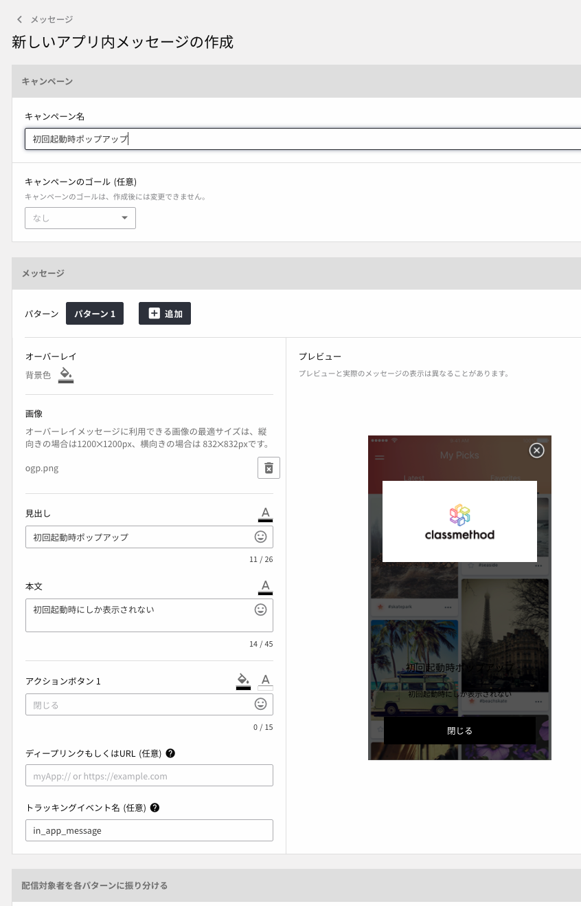
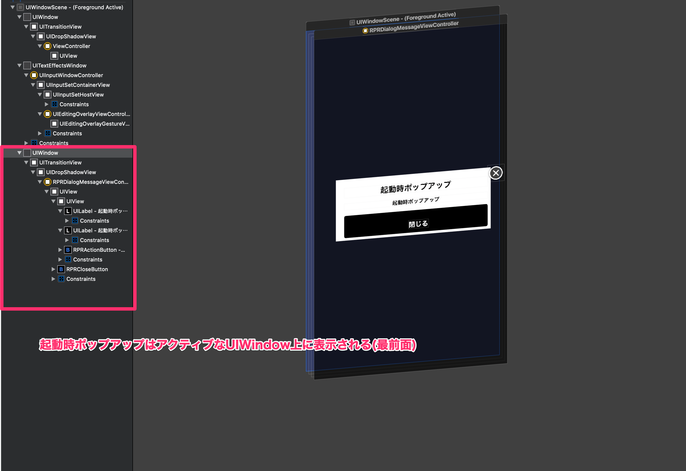
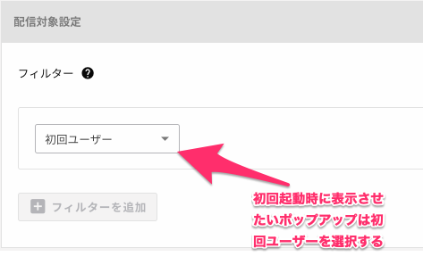

Repro のアプリ内メッセージの基本的な使い方は非常に簡単ですが、いくつか実装前、実装中に考えておかないといけないことがあるように感じたので過去の自分が欲しかった記事を今書こうと思います。

## 対象のユーザー

- Repro の初期セットアップを終えている方
- アプリ内メッセージの利用を考えている方
- 既存アプリでのアプリ内メッセージに類似したポップアップ系の画面との併用を考えている方

### 対象のユーザーでないが興味はある方へ向けて

Developers.IO では過去に Repro 導入に関する記事が公開されています。

- [[Repro] 30 分で出来るはじめての Repro 〜アカウント作成から iOS プロジェクト設定、録画機能まで〜 #repro | Developers.IO](https://dev.classmethod.jp/articles/repro-30-minutes-first-time/)
- [[Repro] アプリ内メッセージのタイプとタイプ別の設定項目まとめ #repro | Developers.IO](https://dev.classmethod.jp/articles/repro-in-app-message-type-and-setting-items/)
- [[Repro] [iOS] アプリ内メッセージ機能の基本の使い方 #repro | Developers.IO](https://dev.classmethod.jp/articles/repro-ios-using-in-app-message/)

これらの記事は 2016 年頃に公開されているので情報が古い場合があります。公式に用意されているドキュメントも丁寧でわかりやすいです。

- [はじめに — Repro ドキュメント](https://docs.repro.io/ja/)
- [開発ガイド — Repro ドキュメント](https://docs.repro.io/ja/dev/index.html)

※ アプリ内メッセージの設定画面。コードは数行で配信の設定はコンソールからできる。



## 既存のポップアップ(present(\_:animated)で表示される画面)や別サービスのアプリ内メッセージとの共存

全て 0 にして Repro だけで実装するぞ！みたいな流れになると一番工数が少ないわけですが、過去の資産をそのまま捨て去ることにもなるので、一旦は併用することになるのも自然なことかと思います。

Repro のアプリ内メッセージは画像の用にもう一つ Active な UIWindow が生成されてその中の UIViewController が表示しています。そのため既存の present(\_:animated)で表示させているモーダルの上に表示されます。それを念頭において起動タイミングや表示のさせ方を考える必要があります。



アプリ起動時にすぐにアプリ内メッセージが表示されてしまうと困る場合や、既存のモーダルの表示との兼ね合いでタイミングを調整したい場合があると思います。そのような場合は`setUp(token:)`の前に`disableInAppMessageOnActive()`を呼び出します。

```swift
Repro.disableInAppMessageOnActive()
Repro.setup(token: "xxxxxxxxxxxxxxxxxxxxxxxxxxxxxxxxxxxxxxxx")
```

そしてアプリ起動時に表示するよう設定したアプリ内メッセージを表示するタイミングで`showInAppMessage()`を呼び出します。

```swift
Repro.showInAppMessage()
```

他にも Repro はカスタムイベントをトリガーとしてアプリ内メッセージを表示できますが、実行タイミング以外気にすることは無いと思います。実行タイミングを含めたアプリ内メッセージのドキュメントは以下になります。

- [アプリ内メッセージ — Repro ドキュメント](https://docs.repro.io/ja/dev/sdk/in-app-message.html#id3)

## アプリ内メッセージの初回起動時と Repro のセッションについて

ドキュメントでセッションについての解説がありますが、これを事前に読んでおくとアプリ内メッセージの挙動が理解しやすいです。

このセッションの仕様により配信対象設定のフィルターで初回ユーザーを指定していないと初回起動時に表示されません。

> Repro のセグメンテーションは、初回セッションをアップロード（※）することでセグメントすることが可能となります。
> 配信条件が「全ユーザー」であっても、メッセージが表示されるのはアプリインストール後２回目以降のアプリ起動となります。
>
> https://support.repro.io/ja/articles/2594521-%E3%82%A2%E3%83%97%E3%83%AA%E5%86%85%E3%83%A1%E3%83%83%E3%82%BB%E3%83%BC%E3%82%B8%E3%81%8C%E5%88%9D%E5%9B%9E%E8%B5%B7%E5%8B%95%E6%99%82%E3%81%AB%E8%A1%A8%E7%A4%BA%E3%81%95%E3%82%8C%E3%81%BE%E3%81%9B%E3%82%93-%E4%BD%95%E3%81%8C%E5%8E%9F%E5%9B%A0%E3%81%A7%E3%81%99%E3%81%8B



フィルタに初回ユーザー以外（例えば全ユーザー）を指定した場合は 2 回目以降に表示されることを念頭に置く必要があります。

セッションについてのドキュメントは以下になります。

- [セッション・ライフサイクル — Repro ドキュメント](https://docs.repro.io/ja/dev/sdk/session.html#id1)

### 一度表示した後すぐにタスクキルをして再度起動すると showInAppMessage()をコールしても呼ばれない

セッションデータが Repro に送られるタイミングはアプリがバックグラウンドに遷移するタイミングです。

デバッグモードにしてバックグラウンドにした際のコンソールの出力を覗いてみました。

```
2020-04-02 22:59:37.542563+0900 Repro_Sample[4994:1080747] DEBUG: Repro ========> RESIGN ACTIVE
2020-04-02 22:59:38.139693+0900 Repro_Sample[4994:1080747] DEBUG: Repro ========> BACKGROUND
2020-04-02 22:59:38.158609+0900 Repro_Sample[4994:1080767] DEBUG: Repro Uploader entered background. Upload interval set to: 1.0 sec.
2020-04-02 22:59:38.159020+0900 Repro_Sample[4994:1080767] DEBUG: Repro prepare for background task
2020-04-02 22:59:38.159283+0900 Repro_Sample[4994:1080764] INFO : Repro Stop session
2020-04-02 22:59:38.162003+0900 Repro_Sample[4994:1080764] INFO : Repro Session: Active -> Stopping
2020-04-02 22:59:38.164789+0900 Repro_Sample[4994:1080829] DEBUG: Repro Set user profile: ___repro___locale = ja-JP
2020-04-02 22:59:38.170354+0900 Repro_Sample[4994:1080829] DEBUG: Repro Set user profile: ___repro___time_zone = Asia/Tokyo
2020-04-02 22:59:38.171879+0900 Repro_Sample[4994:1080829] DEBUG: Repro Set user profile: ___repro___last_session_date = 2020-04-02 13:59:29.514
2020-04-02 22:59:38.184970+0900 Repro_Sample[4994:1080764] DEBUG: Repro User profile for this session(id="ユーザー名"): (
        {
        name = "___repro___last_session_date";
        type = datetime;
        value = "2020-04-02 13:59:29.514";
    },
        {
        name = "___repro___time_zone";
        type = string;
        value = "Asia/Tokyo";
    },
        {
        name = "___repro___locale";
        type = string;
        value = "ja-JP";
    }
)
2020-04-02 22:59:38.185341+0900 Repro_Sample[4994:1080764] INFO : Repro Session: Stopping -> Inactive
2020-04-02 22:59:38.192402+0900 Repro_Sample[4994:1080829] DEBUG: Repro Uploader received session finish hint. Will check session directories...
2020-04-02 22:59:38.193311+0900 Repro_Sample[4994:1080829] DEBUG: Repro Invalid session directory: xxxxxxx
2020-04-02 22:59:38.196000+0900 Repro_Sample[4994:1080829] DEBUG: Repro Uploading: xxxxxxxxxx
```

確かにアプリをバックグラウンドにするとトラッキングデータを含むセッションデータが送信されているのを確認できます。

急なタスクキルやアプリのクラッシュでこのタスクが完了できなかった場合は次回アプリ起動時にアップロードされます。

この仕様により検証で何度かアプリ内メッセージを表示させようと同じ操作を繰り返していると表示されない場合がありました。

また、に Repro 側で n 回目の表示データをまだとりこまれていない。基本的には数秒程度でとりこまれるが、負荷によっては遅れる場合もあるとのことでした(問い合わせ時の回答)。

これら以外にもアプリ内メッセージが表示されない理由として考えられるものは以下の FAQ ページにあるので表示されない場合は参照すると良いかもしれません。ほとんどが事前の設定ミスなのでこれらに該当しないかまず確認するべきだと思います。

- [アプリ内メッセージが表示されません。どのような理由が考えられますか？ | Repro Knowledge Base](https://support.repro.io/ja/articles/1974735-%E3%82%A2%E3%83%97%E3%83%AA%E5%86%85%E3%83%A1%E3%83%83%E3%82%BB%E3%83%BC%E3%82%B8%E3%81%8C%E8%A1%A8%E7%A4%BA%E3%81%95%E3%82%8C%E3%81%BE%E3%81%9B%E3%82%93-%E3%81%A9%E3%81%AE%E3%82%88%E3%81%86%E3%81%AA%E7%90%86%E7%94%B1%E3%81%8C%E8%80%83%E3%81%88%E3%82%89%E3%82%8C%E3%81%BE%E3%81%99%E3%81%8B)

### 同じイベントトリガーで複数のアプリ内メッセージの配信が行われた場合の挙動

> Repro SDK は設定された表示イベントが発火したタイミングで、１つのアプリ内メッセージを表示します。
> なお、アプリ内メッセージの表示順序は不定です。
>
> https://support.repro.io/ja/articles/1974704-%E5%90%8C%E3%81%98%E3%82%A4%E3%83%99%E3%83%B3%E3%83%88%E3%83%88%E3%83%AA%E3%82%AC%E3%83%BC%E3%81%A7%E8%A4%87%E6%95%B0%E3%81%AE%E3%82%A2%E3%83%97%E3%83%AA%E5%86%85%E3%83%A1%E3%83%83%E3%82%BB%E3%83%BC%E3%82%B8%E3%81%AE%E9%85%8D%E4%BF%A1%E3%81%8C%E8%A1%8C%E3%82%8F%E3%82%8C%E3%81%9F%E5%A0%B4%E5%90%88-%E7%AB%AF%E6%9C%AB%E5%81%B4%E3%81%A7%E3%81%AF%E3%81%A9%E3%81%AE%E3%82%88%E3%81%86%E3%81%AB%E8%A1%A8%E7%A4%BA%E3%81%95%E3%82%8C%E3%81%BE%E3%81%99%E3%81%8B

この挙動は自然だと思いますが同じ表示イベントが設定されていた場合は片方の表示が終わるともう片方の表示が終わるわけではないです。

## まとめ

Repro は設定も導入も実装も簡単です。ユーザープロフィールを使えば細かいプロファイリングもできそうで良いツールだと思いました。要件を満たせるように細かい挙動を手元で動かしたりした結果をまとめた形になりましたが、引き続き Repro を触っていきたいと思います。
