# FlutterのThemeについて

CX事業本部の田辺です。少し前にFlutterのThemeクラスを理解したいと思って周辺のドキュメントを流し読みしていました。今回はもう一度ドキュメントを読み込み手元で動かして挙動を確認した内容を記事にします。


## Theme とは

子以下のWidgetにテーマを適用するためのクラスです。ここでいうテーマは`A theme describes the colors and typographic choices of an application`です。アプリケーションの色やテキストの表現方法に統一性をもたせて管理できます。

### 基本的な使い方

手元に最低限の機能を持ったToDoアプリがあります。このアプリのコードはThemeを使っておらず、個別にスタイルを指定しています。

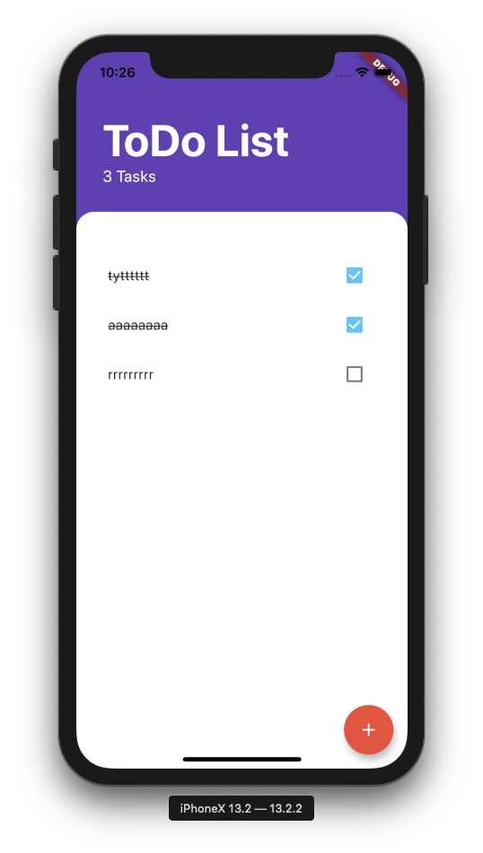

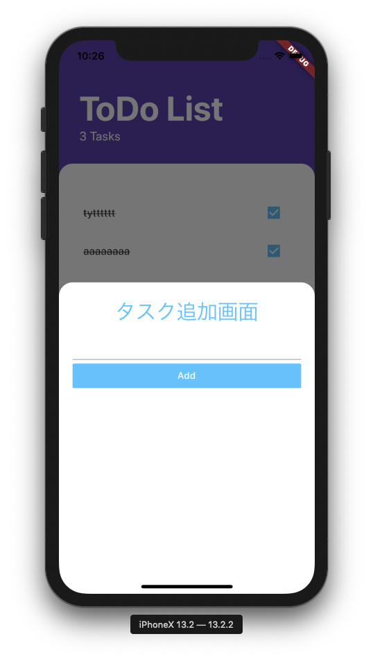

統一感を持たせるかは個別のスタイルの指定次第です。

このアプリにThemeを使ってみます。

基本的にThemeはMaterialAppのコンストラクタ引数themeにThemeDataを指定することでアプリ全体にテーマが適用されます。

```dart
import 'package:flutter/material.dart';
import 'package:provider/provider.dart';

import 'models/task_data.dart';
import 'screens/tasks_screen.dart';

void main() => runApp(MyApp());

class MyApp extends StatelessWidget {
  final String data = "Top Secret Data";
  @override
  Widget build(BuildContext context) {
    return ChangeNotifierProvider(
      create: (context) => TaskData(),
      child: MaterialApp(
        home: TasksScreen(),
      ),
    );
  }
}
```

を以下のようにします。

```dart
class MyApp extends StatelessWidget {
  final String data = "Top Secret Data";
  @override
  Widget build(BuildContext context) {
    return ChangeNotifierProvider(
      create: (context) => TaskData(),
      child: MaterialApp(
        home: TasksScreen(),
        theme: ThemeData(primaryColor: Colors.purple), // コンストラクタ引数themeにThemeDataを渡す
      ),
    );
  }
}

```

#### ThemeDataについて

ThemeDataを指定しますがここまでThemeDataに関する説明を行ってません。そこでまずはThemeDataとは何か、どのような役割を持ったクラスなのかを紹介します。

ドキュメントは以下になります。

- [ThemeData class - material library - Dart API](https://api.flutter.dev/flutter/material/ThemeData-class.html)

マテリアルデザインのテーマの色と文字表現のデザイン処理(タイポグラフィと表現されてます)を保持します。現在のテーマを取得するには、Theme.ofを使用します。

ThemeDataの各プロパティに値をコンストラクタ経由でセットすることでスタイルの微調整ができます。

ThemeDataのソースコードを読むとfactory Constructorが定義されています。コンストラクタ引数には`@required`がついていないので省略可能です。省略された場合はFlutter側で値をセットしてくれます。使用者は適宜変えたい所だけ変更すれば良いだけです。少しだけコードを貼ります。長いので省略してかつコメントを挿入しています。

```dart
factory ThemeData({
    Brightness brightness,
    MaterialColor primarySwatch,
    Color primaryColor,
    Brightness primaryColorBrightness,
    Color primaryColorLight,
    Color primaryColorDark,
    Color accentColor,
    Brightness accentColorBrightness,
    Color canvasColor,
    // 以下大量のコンストラクタ引数の列挙   
  }) {
    // コンストラクタの中身がこちら。
    // このコンストラクタの引数に値が渡されなくてもFlutter側でよしなにThemeDataを作ってくれていることがわかる
    brightness ??= Brightness.light;
    final bool isDark = brightness == Brightness.dark;
    primarySwatch ??= Colors.blue;
    primaryColor ??= isDark ? Colors.grey[900] : primarySwatch;
    primaryColorBrightness ??= estimateBrightnessForColor(primaryColor);
    primaryColorLight ??= isDark ? Colors.grey[500] : primarySwatch[100];
    primaryColorDark ??= isDark ? Colors.black : primarySwatch[700];
    final bool primaryIsDark = primaryColorBrightness == Brightness.dark;
    toggleableActiveColor ??= isDark ? Colors.tealAccent[200] : (accentColor ?? primarySwatch[600]);
    accentColor ??= isDark ? Colors.tealAccent[200] : primarySwatch[500];
    accentColorBrightness ??= estimateBrightnessForColor(accentColor);
    final bool accentIsDark = accentColorBrightness == Brightness.dark;
    canvasColor ??= isDark ? Colors.grey[850] : Colors.grey[50];
    scaffoldBackgroundColor ??= canvasColor;
    bottomAppBarColor ??= isDark ? Colors.grey[800] : Colors.white;
    cardColor ??= isDark ? Colors.grey[800] : Colors.white;
    dividerColor ??= isDark ? const Color(0x1FFFFFFF) : const Color(0x1F000000);

    // Create a ColorScheme that is backwards compatible as possible
    // with the existing default ThemeData color values.
    colorScheme ??= ColorScheme.fromSwatch(
      primarySwatch: primarySwatch,
      primaryColorDark: primaryColorDark,
      accentColor: accentColor,
      cardColor: cardColor,
      backgroundColor: backgroundColor,
      errorColor: errorColor,
      brightness: brightness,
    );
```

ThemeDataのプロパティはかなりたくさんあるのでデフォルト設定を利用しつつ個別に必要な所のみ変更することになるのかなと思っています。

#### ThemeDataを子Widgetで利用する

MaterialAppのTHemeに指定しても直接色を指定している部分はThemeが反映されません。

```dart
@override
  Widget build(BuildContext context) {
    return ListTile(
      onLongPress: longPressCallback,
      title: Text(
        taskTitle,
        style: TextStyle(
          decoration: isChecked ? TextDecoration.lineThrough : null,
        ),
      ),
      trailing: Checkbox(
        activeColor: Colors.lightBlueAccent, // 直接指定しているのでThemeが反映されない
        value: isChecked,
        onChanged: checkboxCallback,
      ),
    );
  }
```


ListTileはタスク一覧画面で使用しています。チェックボックスに直接色を指定しているのでこれを削除します。

削除前
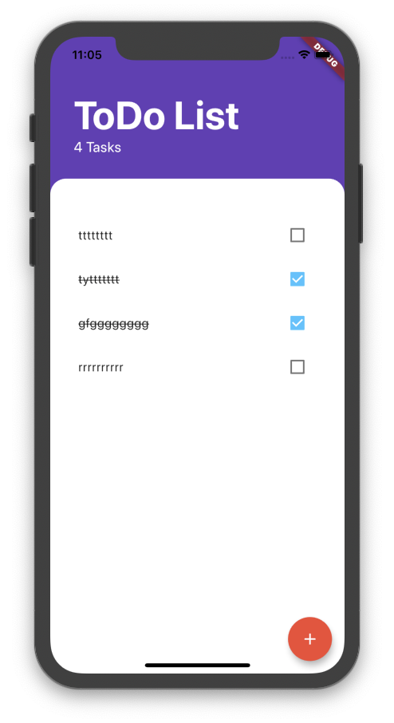

削除後
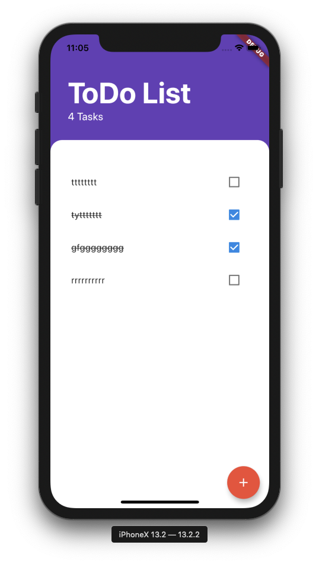

自動で各Widgetで設定される色やスタイルでなく設定したThemeData由来ではあるものの少しカスタマイズしたい場合があります。そのような時は冒頭に記載したようにTHeme.of(context)で共通のThemeDataを取得してプロパティを利用します。

今回はTheme.ofで取り出したつつこれまでどおりチェックが入った時は取り消し線が入るようにdecorationプロパティをカスタマイズしたりフォントサイズを変更したりするため`copyWith()`を使います。

```dart
 @override
  Widget build(BuildContext context) {
    return ListTile(
      onLongPress: longPressCallback,
      title: Text(
        taskTitle,
        style: Theme.of(context).textTheme.body2.copyWith(
              decoration: isChecked ? TextDecoration.lineThrough : null,
            ),
      ),
      trailing: Checkbox(
        value: isChecked,
        onChanged: checkboxCallback,
      ),
    );
  }
}

```


変更前
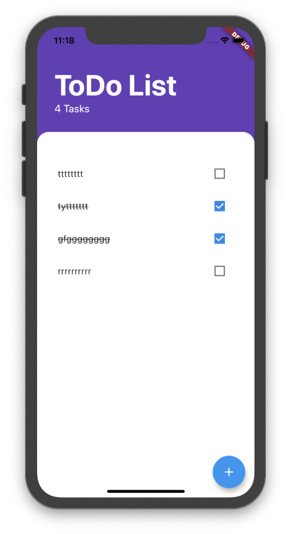

変更後
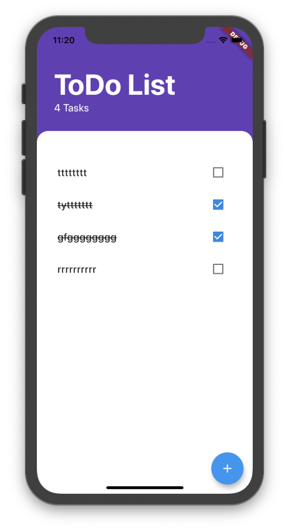


## ダークモード対応

Flutterでダークモード対応を行う時はMaterialAppのコンストラクタ引数darkThemeに値を指定します。

```dart
Widget build(BuildContext context) {
  return ChangeNotifierProvider(
    create: (context) => TaskData(),
    child: MaterialApp(
      home: TasksScreen(),
      theme: kLightThemeData,
      darkTheme: kDarkThemeData, // ダークテーマ用のThemeDataを指定する
    ),
  );
}
```

それでも固定でColorを指定していたWidgetの色はこれでも切り替わらないので、そこは`Theme.of`で取り出して任意の色やstyleを指定していく必要があります。

ライトモード

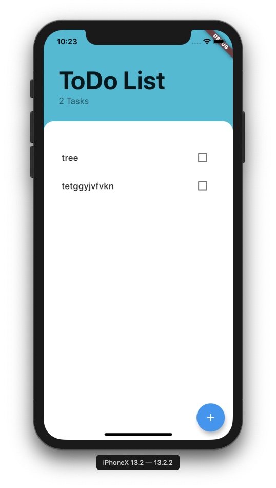

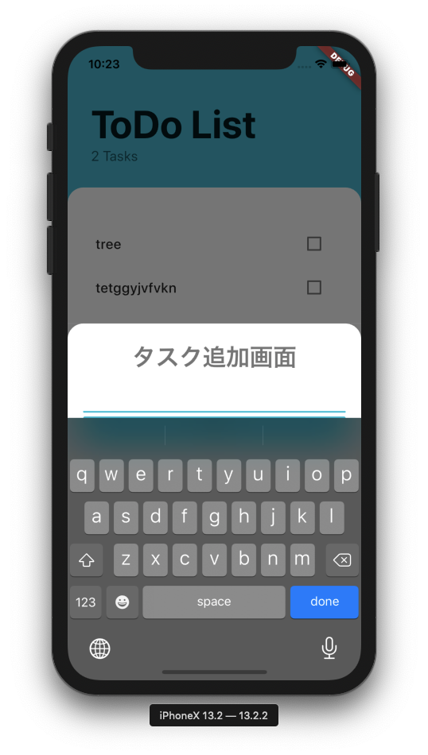

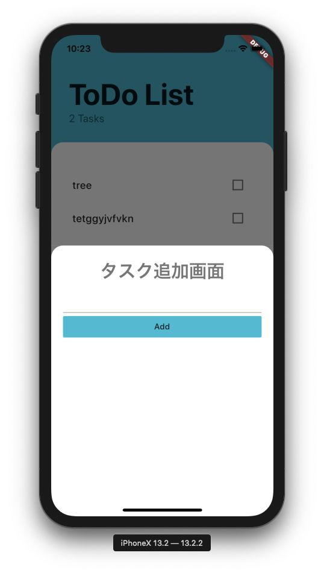

ダークモード

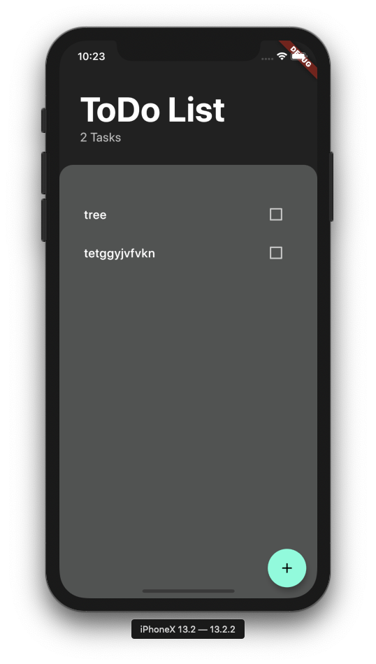

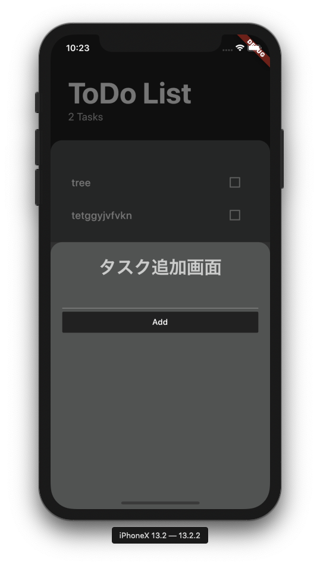

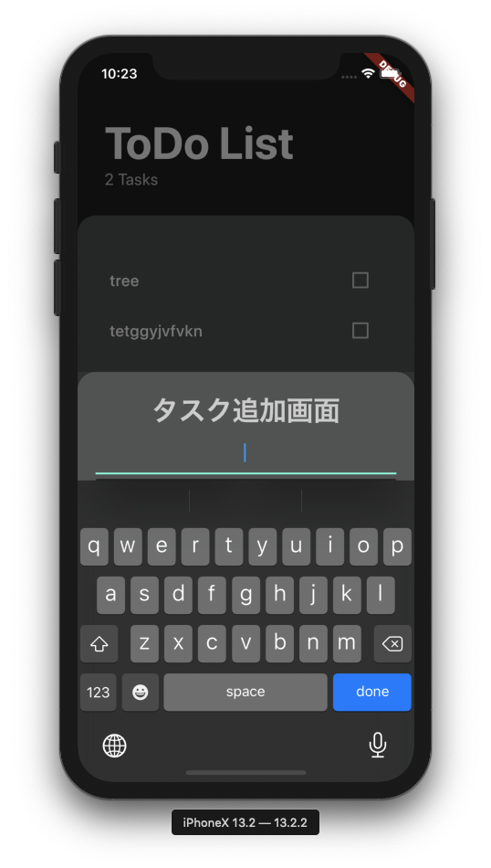


## Theme.ofで取得したThemeDataから取り出したプロパティの値をカスタマイズしたい時

通常は

```dart
Theme.of(context).textTheme.body1
```

このような感じで必要な値を取り出していけば良いと思いますが、どうしても基本的なスタイルは踏襲しつつも色だけ変えたい等細かいカスタマイズはしたい、でも変えたいのは数箇所で全体としてのスタイルを変えたいわけじゃないというようなことがあります。

```dart
ThemeData kLightThemeData = ThemeData.light().copyWith(
  primaryColor: Colors.cyan, // ここで変更した場合は当然子WidgetでprimaryColorを取り出したら`Colors.cyan`で返ってくる
  backgroundColor: Colors.white,
);
```

そのような時に使うメソッドがmerge()、apply()、そして上のコードで使用しているcopyWith()です。この記事を書くまではcopyWith()しか知りませんでした。

実際のコードです。

以下のTextは画面の見出しに相当するエリアのWidgetです。

```dart
Text(
  'ToDo List',
  style: TextStyle(
    color: Theme.of(context).textTheme.title.color,
    fontSize: 50.0,
    fontWeight: FontWeight.w700,
  ),
)
```

merge()を使うとthemeのマージ元をマージ先で上書きして返します。このメソッドのソースを見ると、TextTheme.inheritプロパティの値で挙動が変わる旨が記載されています。inheritプロパティはnull値は祖先のTextTheme（TextSpanツリーなど）の値に置き換えられるかどうかを表します。

- [inherit property - TextStyle class - painting library - Dart API](https://api.flutter.dev/flutter/painting/TextStyle/inherit.html)

これがfalseの場合、明示的な値を持たないプロパティはデフォルトの値がセットされます。

これを踏まえた上でmerge メソッドのドキュメントを見てみます。

- [merge method - TextStyle class - painting library - Dart API](https://api.flutter.dev/flutter/painting/TextStyle/merge.html)


引数に指定されたTextStyleのinheritプロパティががtrueに設定されている場合、引数に指定されたTextStyleの値がnullのプロパティの値が呼び出し元のnullでないプロパティの値に置き換わります。

一方falseが指定されている場合は、引数に指定されたTextStyleは変更されません。

> The other style does not inherit properties of this style.

と記載されています。otherは引数に渡されたTextStyleです。

以下のように使います。

```dart
Text(
  'ToDo List',
  style: Theme.of(context).textTheme.headline.merge(TextStyle(
        fontWeight: FontWeight.w700,
        fontSize: 35.0,
      )),
);
```

mergeメソッドとの使い分けについてもドキュメントに記載があります。2つのTextThemesのすべてのフィールドをマージするのではなく、TextThemeの個々のフィールドをオーバーライドする場合は、copyWithがmergeの代わりに使用されます。

> copyWith is used instead of merge when you wish to override individual fields in the TextTheme instead of merging all of the fields of two TextThemes.

また、applyメソッドはそれぞれのフィールドに引数に与えられた設定を適用して新たなTextStyleを返します。

非数値の引数に関しては与えられた値に置き換えられてTextThemeを返します。数値の引数に関してはapplyのドキュメントに以下のように記載されています。

> The numeric properties are multiplied by the given factors and then incremented by the given deltas.

例えばfontSizeに関する引数fontSizeFactorとfontSizeDeltaに値を渡してapplyを呼び出した場合(例: `style.apply(fonSizeFactor: 2.0, fontSizeDelta: 1.0)`)とした場合は`style.fontSize * fontSizeFactorに指定された2.0 + fontSizeDeltaに指定された1.0`になります。

applyがreplaceとapplyの中のロジックに基づいて値が適用されて新たなTextStyleが返されるのに対してcopyWithは単純に与えられた値に置き換えられるだけなので、要件に応じて使い分けられそうです。

この記事を書こうとするまで直接指定したり使ったとしてもcopyWithぐらいだったので良い勉強になりました。

## まとめ

Themeについてここまで書いてきました。でもまだThemeDataのプロパティのどこを変えるとどう変わるか把握しきれいていない部分があります。

そのために良さそうな[rxlabz/panache: 🎨 Flutter Material Theme editor](https://github.com/rxlabz/panache)というツールがあります。実際のアプリケーションではベースのThemeからcopyWithで個別にカスタマイズするのがマテリアルデザインに乗っかれて良さそうだなと思っているのですが各プロパティの理解を深めたいので触ってみたいと思います。触れたら記事にするつもりです。

最後になりますが、なるべく丁寧に記事を書いたつもりですが誤りや認識のズレがあるかもしれません。その際はコメントにてお気軽にご指摘ください。修正させていただきます。

## 参考にした記事

- [Use themes to share colors and font styles - Flutter](https://flutter.dev/docs/cookbook/design/themes)
- [Flutter: Apply style as a Theme in a Text widget - Flutter Community - Medium](https://medium.com/flutter-community/flutter-apply-style-as-a-theme-in-a-text-widget-90268328bd23)
- [FlutterのThemeを理解する](https://itome.team/blog/2019/12/flutter-advent-calendar-day12/)
- [Flutterでアプリ全体を統一感のあるデザインにする方法 - Qiita](https://qiita.com/sekitaka_1214/items/e25f2f3b282b0ff382cf)
